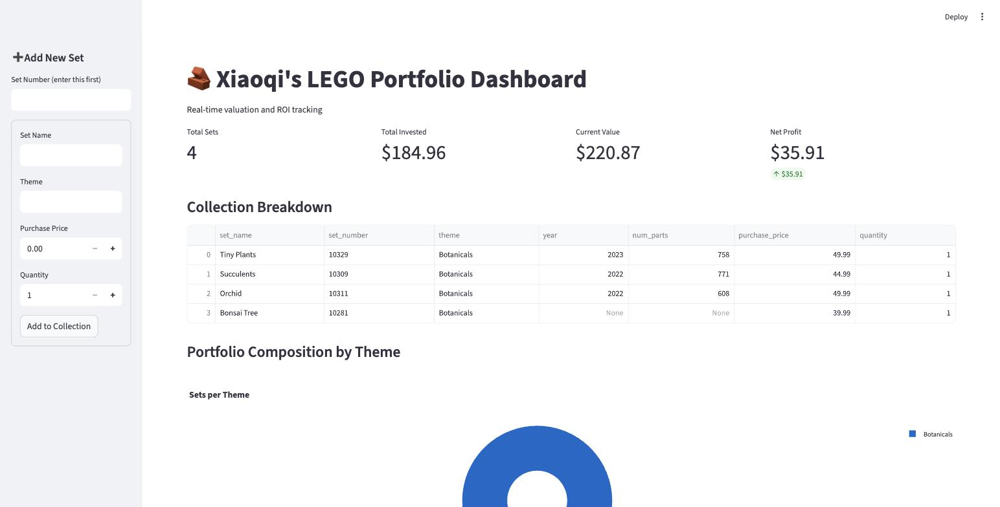
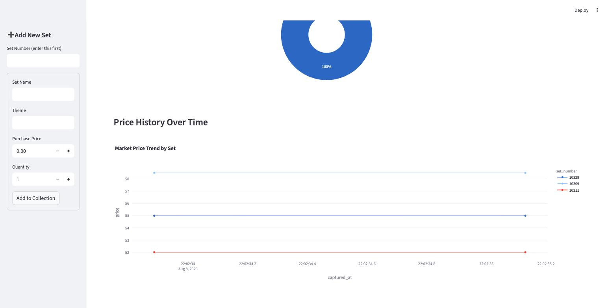

<div align="center">
  <h1>LEGO Portfolio Tracker API</h1>
  
  <p> 🌸 A full-stack solution for tracking the financial growth of LEGO collections 🌸 </p>
</div>

<p>A comprehensive portfolio management system featuring a FastAPI backend and a Streamlit analytics dashboard.<p>

## 🔗 Live Demo
- **Dashboard:** [de-lego-portfolio-api.streamlit.app](https://de-lego-portfolio-api.streamlit.app)
- **API Docs (Swagger UI):** [lego-portfolio-api.onrender.com/docs](https://lego-portfolio-api.onrender.com/docs)

> Note: the backend runs on Render's free tier, which spins down after inactivity. The first request after a period of inactivity may take 30–60 seconds to respond while the service wakes up.

## 📸 Demo

<p align="center">
  
</p>

<p align="center">
  
</p>

Top: live portfolio metrics (invested vs. current value, net profit), the collection table, and a theme-breakdown pie chart. Bottom: the per-set price trend, built from `price_history` snapshots. The sidebar "Add New Set" form (visible in the top screenshot) calls `/lookup-set/{set_number}` as you type, auto-filling name/theme/year/piece count from Rebrickable.

Easiest way to see it yourself: click the [live dashboard](https://de-lego-portfolio-api.streamlit.app) link above — no setup required (just allow ~30–60s for Render to wake up on the first request). To run it locally instead, see **How to Run Locally** below.

## Tech Stack
- **Backend:** FastAPI (Python), deployed on Render
- **Frontend:** Streamlit (Data Dashboard & Interactive Forms), deployed on Streamlit Community Cloud
- **External Data:** Rebrickable API (real LEGO catalog data — set names, themes, year, piece count, images)
- **Visualization:** Plotly (Financial & Time-Series Charts)
- **Data Engineering:** Custom ETL Pipeline + Scheduled Price Snapshotting (idempotent, duplicate-safe)
- **Validation:** Pydantic (Request/Response Schemas)
- **Database:** SQLite with SQLAlchemy ORM
- **ORM:** SQLAlchemy (for Python-to-SQL translation)
- **Environment Management:** `python-dotenv` for secure config

## 🏛️ System Architecture
- **`lego_sets` table:** One row per owned set, enriched with `year`, `num_parts`, and `image_url` from Rebrickable. Unique constraint on `set_number` prevents duplicate entries.
- **`price_history` table:** Append-only time-series log. Every snapshot run inserts a new row per set with a timestamp (`captured_at`), rather than overwriting the last known price — this is what powers the price trend chart on the dashboard.

### Live Set Lookup
`GET /lookup-set/{set_number}` calls Rebrickable server-side and returns the set's real name, theme, year, piece count, and image. The dashboard's "Add New Set" form calls this endpoint the moment you enter a set number, auto-filling the rest of the form — all external API calls are made by the backend, so the frontend never needs its own copy of the API key.

### Market Simulation Engine
To decouple financial logic from external API latency, the system utilizes a **Mock Service** (`services/market.py`). This allows for consistent ROI calculations and local development while eBay/BrickLink API credentials are in the activation phase.

### Price History / Time-Series Tracking
`scripts/snapshot_prices.py` loops through every owned set, fetches its current market price, and appends a new row to `price_history`. Running this script periodically (manually today, on a schedule eventually) builds a genuine time-series dataset, which the dashboard visualizes as a per-set trend line via Plotly.

### Security & API Integration
- **Environment Management:** API keys are secured via `.env` and excluded from version control.
- **Authentication:** Prepared for `requests-oauthlib` handshakes for future marketplace integrations.

### Deployment Architecture
- **Backend** (`main.py`) is deployed to **Render**, using the root-level `requirements.txt`.
- **Frontend** (`dashboard/dashboard.py`) is deployed to **Streamlit Community Cloud**, using its own scoped `dashboard/requirements.txt` — kept separate from the backend's dependencies so each service only installs what it actually needs.
- The dashboard reads the backend's URL from an `API_BASE_URL` environment variable (set via Streamlit's Secrets manager in production, falling back to `http://127.0.0.1:8000` for local development).
- Since Render's free tier uses ephemeral storage, `main.py` seeds a small set of demo data on startup if the database is empty — so the deployed app is always self-healing after a restart, never booting into an empty dashboard.

## Data Pipeline (ETL)
The project includes a dedicated, idempotent ETL script (`scripts/etl_pipeline.py`) that enriches your own purchase data with real catalog data from Rebrickable.
- **Extract:** You provide a "shopping list" of set numbers + what you personally paid; the script calls the Rebrickable API to fetch the real set name, theme, year, piece count, and image for each one.
- **Transform:** Resolves Rebrickable's numeric `theme_id` into a readable theme name via a second API call, and shapes the combined data to match the database schema.
- **Load:** Checks for existing records by `set_number` before inserting, so the script can be safely re-run without creating duplicates or crashing on constraint violations.

## 🚀 Current Progress
- [x] Initialized FastAPI Backend & SQLite Schema
- [x] Developed idempotent, Rebrickable-powered ETL Pipeline for bulk data ingestion
- [x] Implemented **POST /add-set** with duplicate detection logic
- [x] Created **GET /portfolio/stats** with ROI and Net Profit logic
- [x] Developed Interactive Streamlit Dashboard
- [x] Integrated "Add New Set" Frontend Form with real-time inventory updates and error handling
- [x] Built `price_history` table + snapshot script for time-series price tracking
- [x] Added **GET /portfolio/history** endpoint and Price Trend visualization to dashboard
- [x] Enriched set data with year/piece count/image via Rebrickable
- [x] Added **GET /lookup-set/{set_number}** live lookup, wired into the dashboard's Add Set form
- [x] Deployed backend to Render and dashboard to Streamlit Community Cloud
- [x] Added automated test suite (pytest) + GitHub Actions CI
- [ ] Transition from Mock to Live eBay/BrickLink Market Data
- [ ] Add User Authentication for private portfolios

## 💻 How to Run Locally

### Quickest path — just view the dashboard

`main.py` seeds 3 demo LEGO sets on startup whenever the database is empty, so you can see a fully populated dashboard with **no `.env` file and no ETL step**:

```bash
python3 -m venv .venv                                        # use python3, not python, on Mac
source .venv/bin/activate                                     # .venv\Scripts\activate on Windows
.venv/bin/python -m pip install -r requirements.txt
.venv/bin/python -m pip install -r dashboard/requirements.txt

.venv/bin/python -m uvicorn main:app --reload                 # window 1 — the API
.venv/bin/python -m streamlit run dashboard/dashboard.py      # window 2 — the dashboard
```

Then open **`http://localhost:8501`** for the dashboard, or **`http://127.0.0.1:8000/docs`** for the interactive API docs (Swagger UI).

Without `REBRICKABLE_API_KEY` set, the "Add New Set" form's live lookup will just warn that the set wasn't found and let you fill the fields in manually — everything else (stats, table, charts) works the same either way.

### Full setup — with real Rebrickable data + price history

1. **Setup Environment:** same as above.

2. **Configure Secrets:**
    - Create a `.env` file in the root directory.
    - Add your Rebrickable API key: `REBRICKABLE_API_KEY=your_key_here`

3. **Initialize Data:**
    - Run ETL: `.venv/bin/python scripts/etl_pipeline.py`
    - Take a price snapshot: `.venv/bin/python scripts/snapshot_prices.py` (run this periodically to build price history over time)

4. **Start Server:** same two commands as above.

## ✅ Running Tests

The API is covered by a `pytest` suite (unit tests for the market service/schemas, plus integration tests against the FastAPI routes using an isolated temp SQLite DB — no real Rebrickable calls or demo-data seeding involved).

```bash
.venv/bin/python -m pip install -r requirements-dev.txt
.venv/bin/python -m pytest -v
```

Every run also reports code coverage (`pytest-cov`, configured in `.coveragerc`) scoped to the backend package — `main.py`, `database.py`, `model.py`, `schemas.py`, `services/` — and currently sits at 100%. `pytest.ini` enforces that with `--cov-fail-under=100`, so a PR that adds backend code without a matching test fails CI. `dashboard/` and `scripts/` are intentionally excluded from this suite — they're not exercised by it (Streamlit UI and one-off ETL scripts), but the dashboard has its own test suite below.

For a browsable HTML report: `.venv/bin/python -m pytest --cov-report=html` then open `htmlcov/index.html`.

Tests run automatically on every push/PR to `main` via GitHub Actions (`.github/workflows/ci.yml`).

## ✅ Running Dashboard Tests

The dashboard has its own test suite (`dashboard/tests/`), separate from the backend's, using Streamlit's `AppTest` framework — it runs `dashboard.py` headlessly and asserts on the rendered widgets, with the backend's HTTP calls mocked (no real server needed). It has its own scoped dev dependencies, mirroring how `dashboard/requirements.txt` is already kept separate from the backend's:

```bash
.venv/bin/python -m pip install -r dashboard/requirements-dev.txt
.venv/bin/python -m pytest dashboard/tests -v
```

Runs automatically on every push/PR to `main` that touches `dashboard/**`, via `.github/workflows/dashboard-ci.yml`.
